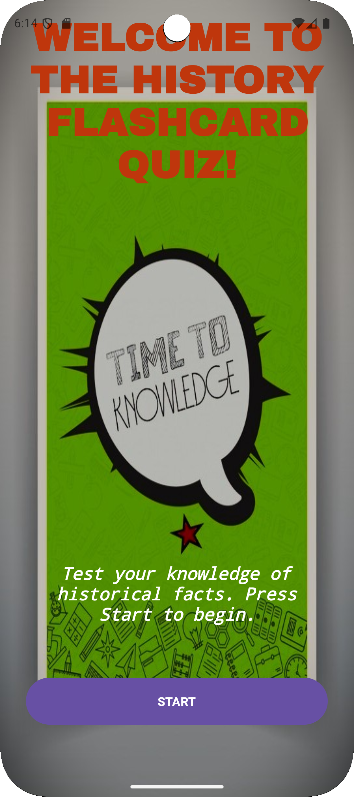
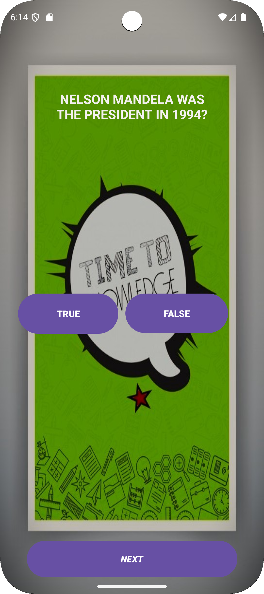
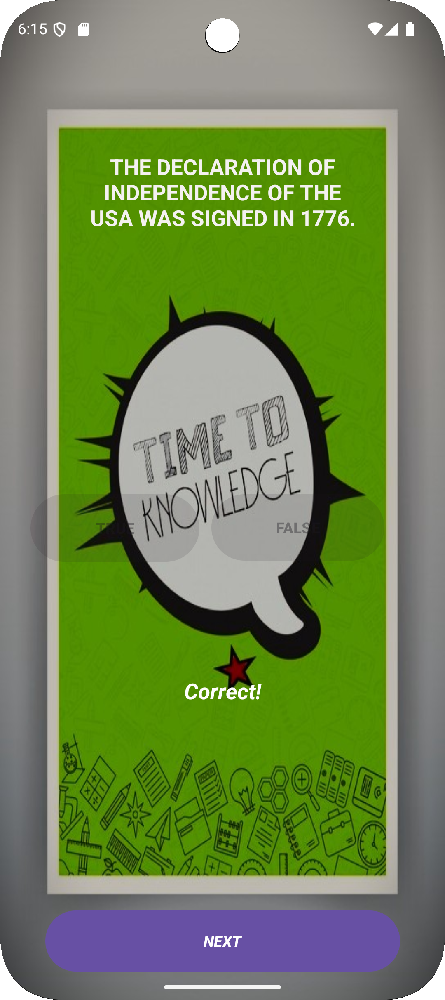
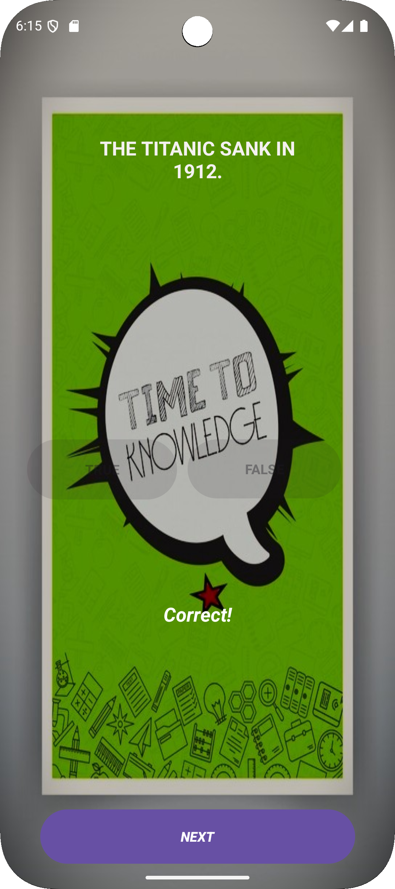
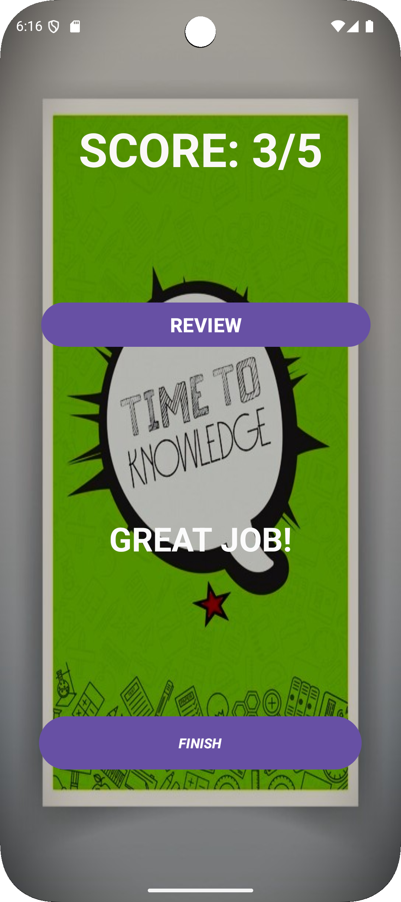
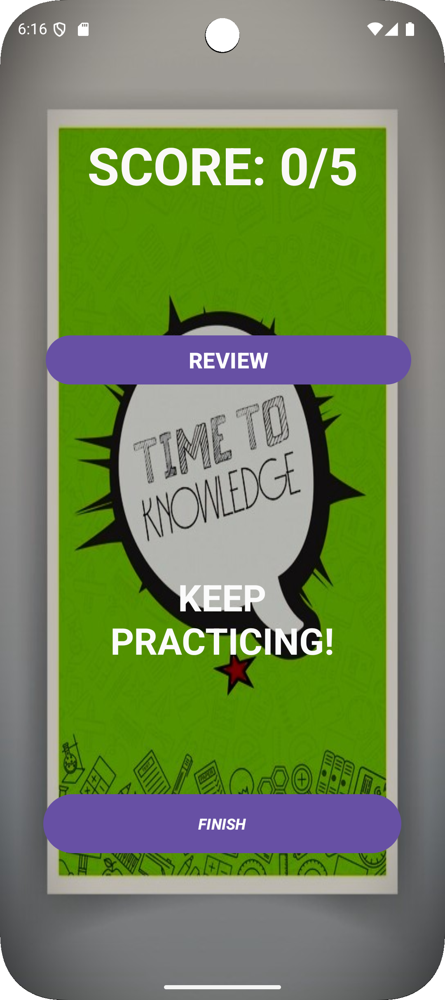
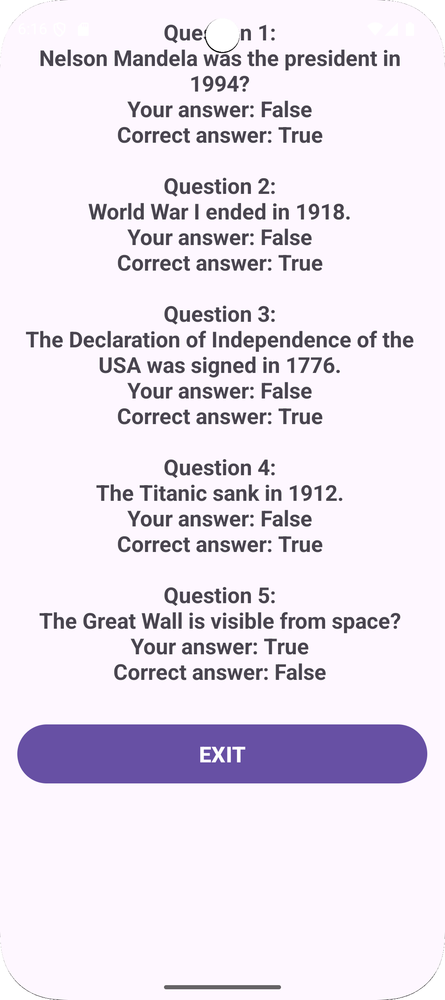

# IPROJECT2
# History Flashcard Quiz App

A simple Android app for testing historical knowledge through true/false questions.

## Features
- 5 historical true/false questions
- Score tracking
- Detailed answer review
- Progress saving during rotation
- Interactive feedback

## Screenshots
main activity

